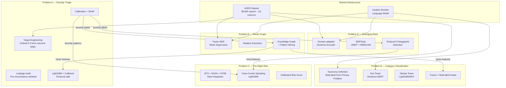
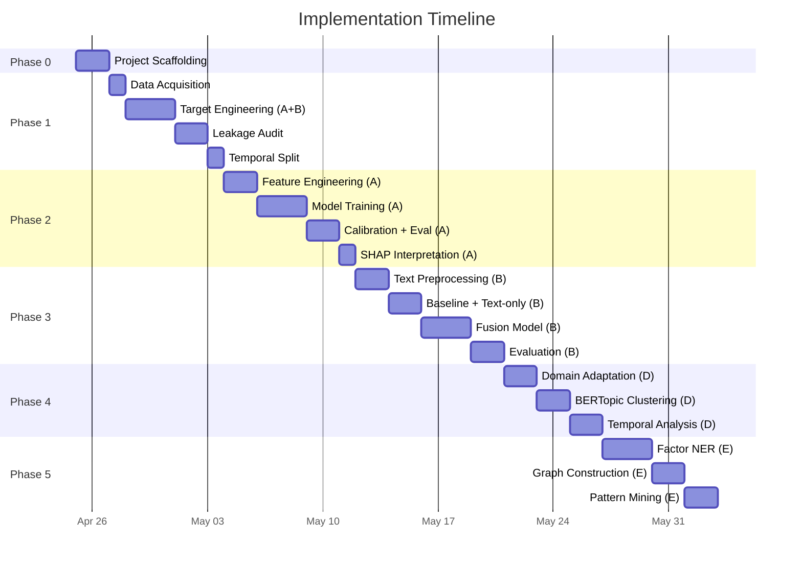

# Flight Risk Analysis — Complete Rebuild Implementation Plan

> [!IMPORTANT]
> This plan rebuilds the project from scratch in a new workspace, fixing every critical flaw identified in the audit: the broken multiclass target, temporal leakage, post-incident feature contamination, and dataset bias misunderstanding.

---

## Architecture Overview



---

## Phase 0 — Project Scaffolding

**Goal:** Clean workspace, dependency management, reproducible environment.

### Directory Structure
```
flight-risk-analysis/
├── pyproject.toml                 # Single dependency spec (uv/poetry)
├── configs/
│   ├── problem_a.yaml
│   ├── problem_b.yaml
│   ├── problem_c.yaml
│   ├── problem_d.yaml
│   └── problem_e.yaml
├── data/
│   ├── raw/                       # Immutable raw downloads
│   ├── interim/                   # Intermediate transforms
│   └── processed/                 # Final model-ready artifacts
├── notebooks/
│   ├── 00_data_acquisition.ipynb
│   ├── 01a_target_engineering.ipynb
│   ├── 01b_leakage_audit.ipynb
│   ├── 02a_severity_model.ipynb
│   ├── 02b_category_model.ipynb
│   ├── 03_emerging_risks.ipynb
│   ├── 04_factor_graph.ipynb
│   └── 05_preflight_risk.ipynb     # Problem C (future)
├── src/
│   ├── __init__.py
│   ├── data/
│   │   ├── __init__.py
│   │   ├── loader.py              # ASRS dataset loading
│   │   ├── target_engineering.py  # Severity rubric + category taxonomy
│   │   └── leakage_audit.py       # Feature whitelist validator
│   ├── features/
│   │   ├── __init__.py
│   │   ├── temporal.py            # Time feature extraction
│   │   ├── encoding.py            # Frequency/target encoding
│   │   └── text.py                # Narrative preprocessing
│   ├── models/
│   │   ├── __init__.py
│   │   ├── severity.py            # Problem A model
│   │   ├── category.py            # Problem B model
│   │   ├── emerging_risks.py      # Problem D pipeline
│   │   └── factor_graph.py        # Problem E pipeline
│   ├── evaluation/
│   │   ├── __init__.py
│   │   ├── ordinal_metrics.py     # QWK, ordinal MAE
│   │   ├── multilabel_metrics.py  # Per-label F1, Hamming loss
│   │   └── calibration.py         # Reliability diagrams, ECE
│   └── utils/
│       ├── __init__.py
│       └── config.py              # YAML config loader
├── models/                        # Serialized model artifacts
├── reports/                       # Generated analysis reports
└── tests/
    ├── test_target_engineering.py
    ├── test_leakage_audit.py
    └── test_temporal_split.py
```

### Key Dependencies
| Package | Purpose | Version |
|---------|---------|---------|
| `lightgbm` | Primary model (native categoricals) | ≥4.0 |
| `catboost` | Secondary model (high-cardinality) | ≥1.2 |
| `optuna` | Hyperparameter optimization | ≥3.0 |
| `shap` | Model interpretation | ≥0.44 |
| `sentence-transformers` | Text embeddings (B, D, E) | ≥2.2 |
| `bertopic` | Topic modeling (D) | ≥0.16 |
| `scikit-learn` | Calibration, metrics, baselines | ≥1.3 |
| `datasets` | Hugging Face ASRS loader | ≥2.0 |
| `pandas` / `polars` | Data manipulation | latest |
| `ruptures` | Changepoint detection (D) | ≥1.1 |

---

## Phase 1 — Data Foundation (Problems A & B shared)

### 1.1 Data Acquisition (`00_data_acquisition.ipynb`)

Load the ASRS dataset, perform column inventory, and save raw parquet.

**Key tasks:**
- Load `elihoole/asrs-aviation-reports` from Hugging Face
- Full column inventory: name, dtype, missing%, unique count, sample values
- Parse `Time_Date` into proper datetime (critical for temporal split)
- Save as `data/raw/asrs_full.parquet`

### 1.2 Target Engineering — Severity Rubric (`01a_target_engineering.ipynb`)

> [!CAUTION]
> This is the single most important notebook. Every downstream model depends on correct target construction. The old project's `create_severity_flag` was keyword-matching against post-incident text — we replace it with a deterministic rubric from physical outcome fields.

**Ordinal Severity Score (0–3):**

| Level | Label | Source Logic |
|-------|-------|-------------|
| 0 | Minor | No damage flag AND no injury AND no emergency AND `Events.5_Result` contains only routine outcomes |
| 1 | Moderate | Minor damage OR near-miss with `Events.1_Miss Distance > threshold` OR `Events.2_Were Passengers Involved = No` |
| 2 | Substantial | Substantial damage in `Events.5_Result` OR injuries reported OR emergency declared |
| 3 | Critical | Aircraft destroyed OR fatalities OR evacuation OR loss of control keywords in `Events.5_Result` |

**Source fields for target (all post-incident, explicitly excluded from features):**
- `Events.5_Result` — physical outcome
- `Events.1_Miss Distance` — near-miss severity
- `Events.2_Were Passengers Involved In Event`
- `Component.3_Problem` — equipment failure severity indicator
- Injury/damage indicators across all Person/Aircraft columns

**Validation:**
- Expected distribution: Level 0 ~40-50%, Level 1 ~25-30%, Level 2 ~15-20%, Level 3 ~5-10%
- If Level 3 > 15%, rubric is too loose
- If Level 0 > 70%, rubric is too strict
- Document as versioned spec (v1.0) with SHA hash of the mapping function

### 1.3 Target Engineering — Category Taxonomy (`01a_target_engineering.ipynb`, continued)

> [!WARNING]
> The old project checked `if 'primary_problem' in df.columns` but the actual column is `Assessments.1_Primary Problem`. This caused 100% "Other" classification — a fatal bug.

**Taxonomy (multi-label):**

| Category | Source: `Assessments.1_Primary Problem` keywords |
|----------|--------------------------------------------------|
| Flight Operations | `Human Factors`, `Ambiguous`, `Procedure` |
| Equipment/System | `Aircraft`, `Equipment/Tooling`, `MEL` |
| ATC/Communication | `Communication Breakdown`, `Clearance` |
| Aircraft/Structure | `Design/Engineering` |
| Environment | `Weather`, `Turbulence` |
| Airspace/Navigation | `Airspace` |

**Multi-label handling:**
- `Assessments_Contributing Factors / Situations` is semicolon-delimited
- Parse into list, map each factor to zero or more categories
- One incident → one or more category labels
- Store as binary indicator matrix (n_samples × n_categories)

### 1.4 Leakage Audit (`01b_leakage_audit.ipynb`)

> [!IMPORTANT]
> Every feature must have a written justification for inclusion or exclusion. The audit result is a YAML whitelist that the training pipeline reads — no feature enters a model without passing this gate.

**Problem A Feature Whitelist (pre-circumstance only):**

| Feature | Justification | Include? |
|---------|--------------|----------|
| `Time_Date` | Known before flight → derive month, year, time-of-day | ✅ Derive features |
| `Time.1_Local Time Of Day` | Observable pre-flight | ✅ |
| `Place_Locale Reference` | Airport/location, known pre-flight | ✅ |
| `Place.1_State Reference` | State, known pre-flight | ✅ |
| `Environment_Flight Conditions` | VMC/IMC, known from weather brief | ✅ |
| `Environment.1_Weather Elements / Visibility` | Weather brief | ✅ |
| `Environment.2_Work Environment Factor` | Operational context | ✅ |
| `Environment.3_Light` | Time-dependent, known | ✅ |
| `Environment.4_Ceiling` | Weather data | ✅ |
| `Environment.5_RVR.Single Value` | Runway visual range | ✅ |
| `Aircraft 1_Make` | Aircraft registration | ✅ |
| `Aircraft 1.1_Model` | Aircraft registration | ✅ |
| `Aircraft 1.2_Operator` | Known pre-flight | ✅ |
| `Aircraft 1.5_Operating Under FAR Part` | Regulatory context | ✅ |
| `Aircraft 1.6_Flight Plan` | Filed pre-flight | ✅ |
| `Aircraft 1.7_Mission` | Planned pre-flight | ✅ |
| `Aircraft 1.8_Flight Phase` | **Known at filing**, but problematic — see note | ⚠️ |
| `Aircraft 1.14_Number of Seats` | Aircraft specification | ✅ |
| `Aircraft 1.15_Crew Size` | Planned pre-flight | ✅ |
| `Person 1.3_Function` | Crew role, known | ✅ |
| `Person 1.4_Qualification` | Known pre-flight | ✅ |
| `Person 1.5_Experience` | Known pre-flight → bucket | ✅ |
| `Events_Anomaly` | **POST-incident** observation | ❌ LEAK |
| `Events.3_Detector` | **POST-incident** — who detected | ❌ LEAK |
| `Events.4_When Detected` | **POST-incident** — when detected | ❌ LEAK |
| `Events.5_Result` | **TARGET SOURCE** | ❌ TARGET |
| `Assessments.1_Primary Problem` | **TARGET SOURCE for Problem B** | ❌ TARGET |
| `Assessments_Contributing Factors` | Analyst assessment, post-hoc | ❌ LEAK |
| `Report 1_Narrative` | Post-incident narrative | ❌ for A, ✅ for B |
| `Report 1.2_Synopsis` | Post-incident synopsis | ❌ for A, ✅ for B |

> [!WARNING]
> The old project included `Events_Anomaly`, `Events.3_Detector`, `Events.4_When Detected`, and `Assessments.1_Primary Problem` as features for the binary model. These are all post-incident observations — the #1 contributor to the inflated AUC of 0.852. Expect performance to drop significantly (realistically to QWK 0.45-0.60) once these are removed.

**Problem B Feature Whitelist (retrospective categorization):**
Problem B classifies *after* the incident is reported, so it can use:
- All Problem A features ✅
- `Events_Anomaly`, `Events.3_Detector`, `Events.4_When Detected` ✅
- `Report 1_Narrative`, `Report 2_Narrative`, `Report 1.2_Synopsis` ✅ (text tower)
- `Assessments.1_Primary Problem` ❌ (this IS the target source)
- `Assessments_Contributing Factors` ❌ (too closely aligned with target)

### 1.5 Temporal Split

> [!NOTE]
> The old project used random `train_test_split` — classic temporal leakage. We split chronologically using `Time_Date`.

**Split strategy:**
```
Train:      Time_Date years 2003–2017
Validate:   Time_Date year 2018
Test:       Time_Date years 2019–2020
```

If `Time_Date` doesn't have year granularity (it may be encoded as a numeric), we'll:
1. Inspect the actual values and decode
2. If truly opaque, use ordinal position (first 70% train, next 15% val, last 15% test)
3. Document the assumption

---

## Phase 2 — Problem A: Incident Severity Classification

### 2.1 Feature Engineering (`02a_severity_model.ipynb`)

**From the audit-approved whitelist:**
- **Temporal:** Extract `month`, `quarter`, `time_of_day_bucket`, `year` from `Time_Date`
- **Experience:** Bucket `Person 1.5_Experience` into ordinal bands (0-1000, 1000-5000, 5000-15000, 15000+)
- **Altitude:** If altitude data available, create bands (ground, low, mid, high, FL)
- **Missingness indicators:** For columns 50-80% missing, add `_is_missing` binary flag
- **Drop:** Columns >80% missing

**Encoding strategy:**
- LightGBM: Use native categorical support (pass as `category` dtype)
- CatBoost: Use native categorical support
- For baseline LogReg: Frequency encoding for high-cardinality, one-hot for low-cardinality

### 2.2 Model Training

**Baseline:**
1. Stratified dummy classifier (majority class)
2. Logistic regression on top-10 features (ordinal encoded target)

**Primary: LightGBM**
- Objective: `multiclass` (4 classes) or custom ordinal-aware loss
- Native categorical feature handling (no one-hot explosion)
- Optuna tuning: 100 trials, 5-fold stratified time-series CV
- Key hyperparameters: `num_leaves`, `max_depth`, `learning_rate`, `min_child_samples`, `colsample_bytree`, `subsample`

**Secondary: CatBoost**
- Robustness check on high-cardinality categoricals
- Same CV strategy
- Compare with LightGBM

### 2.3 Calibration & Evaluation

**Calibration:**
- Isotonic calibration on validation fold
- Reliability diagram (predicted probability vs. observed frequency per class)

**Metrics:**
| Metric | Purpose |
|--------|---------|
| Quadratic Weighted Kappa (QWK) | Primary — penalizes large ordinal errors |
| Ordinal MAE | Average absolute ordinal distance |
| Per-class Precision/Recall with bootstrap 95% CIs | Class-level performance |
| Confusion matrix | Error pattern analysis |
| Reliability diagram | Calibration quality |

**Expected performance:**
- QWK: 0.45–0.60
- Macro-F1: 0.50–0.65
- If numbers come in dramatically higher → suspect residual leakage

### 2.4 Interpretation
- SHAP values on calibrated model
- Slice analysis: by year, by airport class (hub vs. regional), by flight phase
- Feature importance ranking with confidence intervals

---

## Phase 3 — Problem B: Incident Category Classification

### 3.1 Text Preprocessing

**ASRS-specific handling:**
- Replace redaction placeholders (`ZZZ`, `XXX`, `ZZZZ`) with `[REDACTED]` token
- Remove boilerplate headers/footers in narratives
- Sentence segmentation for per-sentence encoding
- Handle missing narratives (some reports have only synopsis)

### 3.2 Model Architecture

**Baseline:** TF-IDF (unigrams + bigrams, max 10k features) + Logistic Regression per label (OVR)

**Mid-complexity:** DistilBERT on narrative only (ablation — how much does text alone give?)

**Full model: Two-tower fusion**
```
Tabular Tower                     Text Tower
(structured features)             (narratives + synopsis)
      │                                 │
  LightGBM leaf                   Sentence-BERT
  embeddings or                   → CLS embedding
  MLP encoder                     (384-768 dim)
      │                                 │
      └─────────── Concatenate ─────────┘
                        │
                  Fusion MLP (256 → 128)
                        │
                Per-category sigmoid heads
                        │
              Multi-label BCE loss
              (class-weighted)
```

### 3.3 Training
- AdamW optimizer with warmup schedule
- Multi-label BCE loss with inverse-frequency class weighting
- Per-label threshold tuning on validation set (optimize F1 per label)

### 3.4 Evaluation
| Metric | Scope |
|--------|-------|
| Per-label P/R/F1 | Each category separately |
| Macro-F1, Micro-F1 | Aggregate |
| Hamming loss | Fraction of wrong labels |
| Subset accuracy | Exact match rate |

**Expected performance:**
- Fusion: Macro-F1 0.60–0.75
- Text-only: Macro-F1 0.55–0.65
- Structured-only: Macro-F1 0.45–0.55

---

## Phase 4 — Problem D: Emerging Risk Pattern Discovery

### 4.1 Domain Adaptation
- Continue-pretrain `all-MiniLM-L6-v2` on 38k ASRS narratives with SimCSE objective
- Small compute budget (~4-8 GPU-hours or CPU overnight)
- Result: aviation-domain sentence encoder

### 4.2 Topic Modeling
- BERTopic pipeline: UMAP (n_neighbors=15, min_dist=0.1) → HDBSCAN (min_cluster_size=15) → c-TF-IDF
- Expected: 100–300 fine-grained topics, hierarchical rollup to 20–30 themes

### 4.3 Temporal Dynamics
- Monthly prevalence time series per cluster
- PELT changepoint detection (from `ruptures` library)
- Flag clusters with statistically significant recent increases

### 4.4 Emerging Risk Scoring
Composite score combining:
- Trend strength (changepoint magnitude)
- Severity association (join with Problem A labels)
- Novelty (new terminology not in historical clusters)

---

## Phase 5 — Problem E: Contributing Factor Graph Analysis

### 5.1 Factor Extraction
- Define aviation factor taxonomy (~50-100 factors)
- Weak supervision: use `Assessments_Contributing Factors / Situations` to label narrative spans
- Fine-tune BERT NER on factor spans

### 5.2 Graph Construction
- Nodes: factors, outcomes, aircraft types, phases
- Edges: co-occurrence weighted by frequency and confidence
- Severity stratification from Problem A labels

### 5.3 Pattern Mining
- Frequent subgraph mining (gSpan or similar)
- Severity-stratified pattern analysis
- Temporal evolution of factor chains

---

## Phase 6 — Problem C: Pre-Flight Risk Prediction (Future)

> [!NOTE]
> Problem C requires entirely different data sources (BTS, NOAA, NTSB) and 6-9 months of dedicated work. It is scoped as a future phase and will be implemented in a separate data pipeline. The infrastructure from Problems A-E (severity rubric, temporal features, factor patterns) feeds into Problem C.

---

## Implementation Priority & Dependencies



---

## Quality Gates

Each phase must pass before proceeding:

| Gate | Criteria |
|------|----------|
| **G0: Scaffolding** | `pytest` passes, data loads successfully, temporal split produces non-overlapping date ranges |
| **G1: Targets** | Severity distribution matches expected range, multiclass has ≥2 meaningful classes, no target field in feature set |
| **G2: Leakage** | Human-reviewed YAML whitelist committed, automated leakage test passes |
| **G3: Severity Model** | QWK 0.45+ on temporal test set, calibration ECE < 0.05, SHAP top features are all pre-circumstance |
| **G4: Category Model** | Macro-F1 0.55+ on temporal test set, text tower ablation shows meaningful contribution |
| **G5: Emerging Risks** | ≥20 coherent topics with interpretable labels, ≥3 detectable changepoints in retrospective validation |
| **G6: Factor Graph** | ≥50 nodes with interpretable labels, ≥10 frequent factor-chain patterns, expert-validated subset |

---

## Integration with Future System

The models produced here become the inference backbone for:
- **FastAPI backend:** Serves predictions from Problem A (severity), Problem B (category), and exposes Problem D (emerging risks) dashboard data
- **React + TypeScript frontend:** Operator-facing dashboard with risk scores, category routing, emerging risk alerts, factor graph explorer
- **Jenkins automation:** Model retraining pipeline, data refresh, A/B testing of model versions

Model artifacts will be serialized in ONNX/joblib format with versioned metadata for seamless integration.

---

## Critical Differences from Old Project

| Aspect | Old Project | New Project |
|--------|------------|-------------|
| **Severity target** | Keyword search in post-incident text | Deterministic rubric from physical outcome fields |
| **Category target** | Checked wrong column name → 100% "Other" | Correct column + multi-label taxonomy |
| **Feature leakage** | Included `Events_Anomaly`, `Assessments.1_Primary Problem` as features | Strict whitelist per problem type |
| **Data split** | Random `train_test_split` | Chronological temporal split |
| **Primary model** | XGBoost with one-hot encoding | LightGBM with native categoricals |
| **Calibration** | Present but on leaked features | Isotonic calibration on clean features |
| **Text usage** | Not used | Full multi-modal fusion for Problem B |
| **Ordinal awareness** | Binary only | 4-level ordinal with QWK metric |
| **Unsupervised** | None | BERTopic + changepoint detection |
| **Knowledge graph** | None | Factor extraction + pattern mining |
